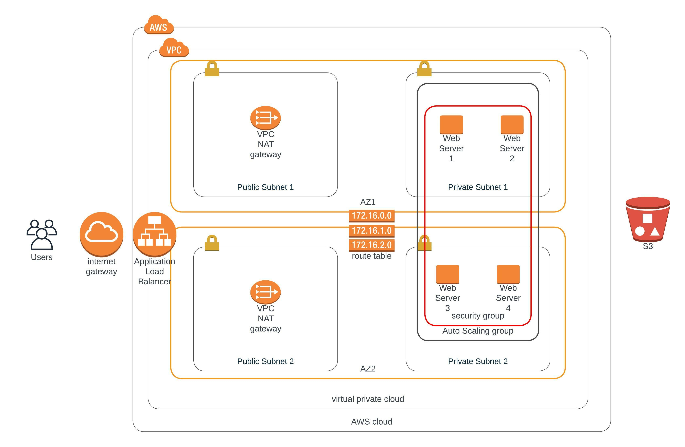

### Udagram Web Application - Deploy a high-availability web app using CloudFormation
In this project, I have built high availability web app using Cloud Formation. We have a set of files which builds the base network in AWS and then a set of files which builds the servers and load balancers.

**Udagram Web Application Architecture**

**Files:**

1. Udagram-network-parameters.json - contains parameters for creating AWS network.
2. Udagram-network-parameters.yml - This yml cloud formation scripts utlizes the parameters file and creates the network.
3. Udagram-server-parameters.json - contains parameters for creating Web application servers and configurations.
4. Udagram-server-parameters.yml - This yml cloud formation scripts utlizes the parameters file and creates the servers.

**Scripts:**

Below script creates stack which deploys network in AWS.

./create.sh Udagram-network Udagram-network.yml Udagram-network-parameters.json

Below script creates stack which deploys servers in AWS.

./create.sh Udagram-servers Udagram-servers.yml Udagram-server-parameters.json

After creating both the stacks using above links, we can navigate to the output section in Udagram-servers stack and click on the load balancer link to view the application in browser.